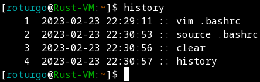

# bashrc
Some Bash improvements to add into your `.bashrc` config file

# Instructions
Append the configurations in `bashrc.txt` to your `.bashrc` configuration file in your home directory.

# Improvements
These are the quality of life enhancements contained in this `.bashrc` template

## History
* Increase the history file size
* Format `history` command output to include a timestamp of when the command was run
* Make it less likely that multiple Bash sessions for the same user will clobber each other's history

## Up-arrow History Completion
* Typing part of a command and pressing up/down will scroll through previous runs of the command from your Bash history

## Shell colors and prompt formatting
* Make your default Bash prompt a bit easier to parse, colorize it, and colorize specific output in your shell

